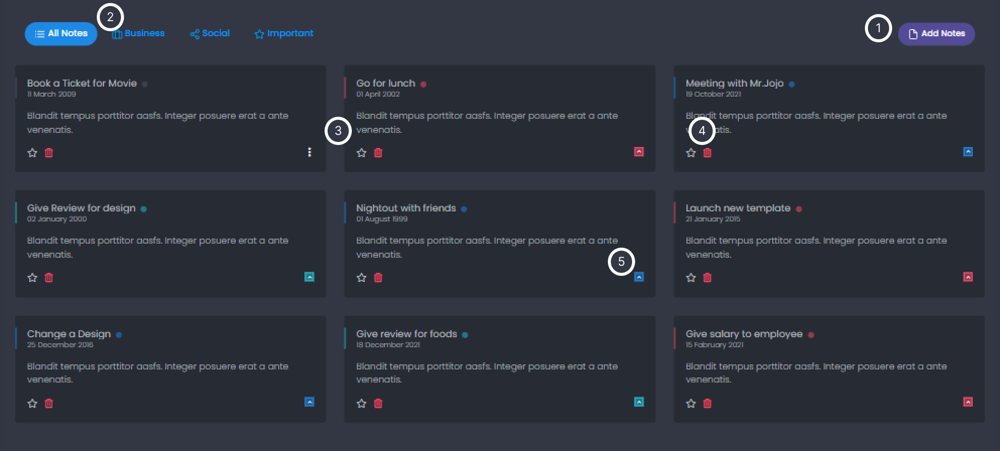

# Subject

## Tree

```text
java
└─com
    └─pb
        └─starter
            │  SubjectController.java
            │  SubjectMapper.java
            │  SubjectService.java
            │  SubjectServiceContext.java
            │  SubjectServiceImpl1.java
            │  SubjectServiceImpl2.java
            │
            └─restController
                    SubjectRestController.java
```

## 기능 구현사항

### UI


1. Subject 추가
2. filter 기능 : category 기능별 filter 기능
3. Note 삭제 : Subject 삭제
4. favorite 기능 : 중요 노트 기능
5. category 기능 : Subject를 카테고리 키워드로 분류

### 서버

1. Subject 추가
2. Subject 삭제
3. Subject 수정
4. Subject 페이징 조회


## Table 정의

```sql
CREATE TABLE `subject` (
`id` bigint NOT NULL AUTO_INCREMENT, -- id 
`title` varchar(45) DEFAULT NULL, -- 제목
`content` varchar(45) DEFAULT NULL, -- 내용
`reg_dt` timestamp NULL DEFAULT CURRENT_TIMESTAMP, -- 등록일
`mod_dt` timestamp NULL DEFAULT CURRENT_TIMESTAMP ON UPDATE CURRENT_TIMESTAMP, -- 수정일
`uuid` varchar(100) DEFAULT NULL, -- uuid
`user_id` bigint DEFAULT NULL, -- 게시글 등록한 사용자 id
`catecory` varchar(45) DEFAULT NULL, -- 카테고리
`favorite` tinyint DEFAULT NULL, -- 중요 노트
PRIMARY KEY (`id`)
) ENGINE=InnoDB AUTO_INCREMENT=6 DEFAULT CHARSET=utf8mb3;

```

### SubjectService.java
```java
package com.pb.starter.subject;

import com.pb.starter.model.SubjectEntity;
import org.springframework.data.domain.Page;
import org.springframework.data.domain.Pageable;

import java.util.List;
import java.util.Optional;

public interface SubjectService {
Optional<SubjectEntity> findById(String id);
List<SubjectEntity> findAll();
int insert(SubjectEntity subject);
int delete(String id);
int update(SubjectEntity subject);
Page<SubjectEntity> pagedList(Pageable pageable);
}
```