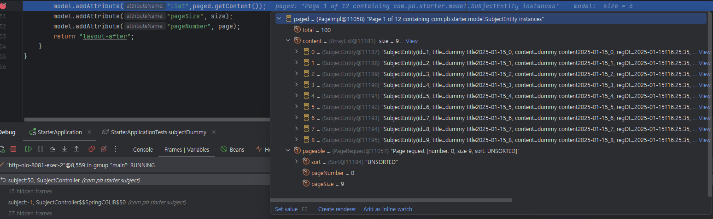

# Pagination with Mybatis

## Pagination의 기본적인 이론

1. Pagination이란?
    - Pagination은 데이터를 페이지 단위로 나누어 보여주는 기능입니다.
    - Pagination을 사용하면 사용자가 데이터를 한 번에 많이 볼 필요 없이 페이지 단위로 데이터를 볼 수 있습니다.

2. Pagination의 구현 방법
Pagination을 구현하기 위해서 서버와 클라이언트에 각각 구현해야 하는 부분이 있습니다.

### 클라이언트
클라이언트에서의 작업:

1. **현재 페이지 번호와 한 페이지에 보여줄 데이터 개수를 서버에 요청**
2. **페이지 네비게이션**
    - 페이지 번호, 이전/다음 버튼 등 사용자가 원하는 페이지로 이동할 수 있는 UI 제공
    - 버튼 클릭 시 해당 요청을 서버로 전달
3. **현재 페이지 상태 표시**
    - 현재 보고 있는 페이지를 강조하여 시각적으로 표시

### 서버
서버에서의 작업:
클라이언트에서 요청한 페이지 번호를 기준으로 데이터를 조회하여 클라이언트에 전달합니다.

이때 Pagination 로직을 처리하기 위해 관리해야 할 정보는 다음과 같습니다:

- **전체 데이터의 개수**
- **한 페이지에 보여줄 데이터의 개수 (`limit`)**
- **현재 페이지 번호 (`offset`)**
- **전체 페이지의 개수**
- **현재 페이지의 데이터**

## Mybatis에서 Pagination 구현하기 (with Spring Data Commons)

### Spring Data Commons와 Mybatis

1. Spring Data Commons이란?
    - Spring Data Commons는 Spring Data 프로젝트의 핵심 모듈입니다.
    - Spring Data Commons는 JPA와 같은 ORM(Object Relational Mapping) 프레임워크, 혹은 비관계형 DB에 대하여(NoSQL,Redis etx...) 일관되고 다양한 데이터 액세스 기술을 지원하는 기반을 제공합니다.

* ORM(Object Relational Mapping) 프레임워크란?
    - ORM(Object Relational Mapping) 프레임워크는 객체와 관계형 데이터베이스의 데이터를 자동으로 매핑해주는 프레임워크입니다.
    - ORM 프레임워크를 사용하면 객체를 통해 간단한 쿼리를 사용하여 데이터베이스에 접근할 수 있습니다.
* 참고: [Spring Data Commons](https://docs.spring.io/spring-data/commons/docs/current/reference/html/)

Spring Data는 ORM에 대하여 강력한 기능들을 지원하지만 Mybatis에 대해서는 직접적인 기능을 지원하진 않습니다.
* Mysbtis는 ORM이 아닌 SQL Mapper입니다.

**하지만 Spring Data Commons에서 제공하는 Page<T> 인터페이스와 Pageable 인터페이스를 이용하여
Mybatis의 페이징 처리를 구현할 수 있습니다.**


#### Spring Data Commons 의존성 추가
```gradle
//mybatis
implementation 'org.mybatis.spring.boot:mybatis-spring-boot-starter:3.0.3'
testImplementation 'org.mybatis.spring.boot:mybatis-spring-boot-starter-test:3.0.3'
	
// https://mvnrepository.com/artifact/org.springframework.data/spring-data-commons
implementation group: 'org.springframework.data', name: 'spring-data-commons', version: '3.4.1'
```

### 구현방법

기본적인 구현 아이디어는 다음과 같습니다.
1. 클라이언트에서 특정 페이지 번호의 조회 요청이 들어옵니다. (페이지번호, 한 페이지에 보여줄 데이터 개수)
2. 컨트롤러에서 요청받은 페이지 번호와 한 페이지에 보여줄 데이터 개수를 기준으로 데이터를 조회합니다.

### Pageable
```java
package org.springframework.data.domain;

import java.util.Optional;
import org.springframework.util.Assert;

public interface Pageable {
    
    
    //code...
    
    int getPageNumber();

    int getPageSize();

    long getOffset();

    //code...
}

```
### Page
```java
package org.springframework.data.domain;

import java.util.Collections;
import java.util.function.Function;

public interface Page<T> extends Slice<T> {
    //code...
}

public interface Slice<T> extends Streamable<T> {
    
    //code...

    List<T> getContent();
    
    //code...
}
```

### PageRequest
```java
package org.springframework.data.domain;

import org.springframework.lang.Nullable;
import org.springframework.util.Assert;

public class PageRequest extends AbstractPageRequest {
    //code...
    
    public static PageRequest of(int pageNumber, int pageSize) {
        return of(pageNumber, pageSize, Sort.unsorted());
    }

    public static PageRequest of(int pageNumber, int pageSize, Sort sort) {
        return new PageRequest(pageNumber, pageSize, sort);
    }

    public static PageRequest of(int pageNumber, int pageSize, Sort.Direction direction, String... properties) {
        return of(pageNumber, pageSize, Sort.by(direction, properties));
    }

    //code...
}

public abstract class AbstractPageRequest implements Pageable, Serializable {
    private static final long serialVersionUID = 1232825578694716871L;
    private final int pageNumber;
    private final int pageSize;
    
    //code...

    public long getOffset() {
        return (long)this.pageNumber * (long)this.pageSize;
    }

    //code...
}
```
---

### Mybatis Mapper

``` mysql

<!-- Paged List -->
    <select id="pagedList" resultType="SubjectEntity">
        SELECT
        *
        FROM subject
        WHERE 1=1
        <if test="searchParam.title != null and searchParam.title != ''">
            AND title LIKE CONCAT('%', #{searchParam.title}, '%')
        </if>
        <if test="searchParam.content != null and searchParam.content != ''">
            AND content LIKE CONCAT('%', #{searchParam.content}, '%')
        </if>
        ORDER BY id
        LIMIT #{pageable.pageSize} OFFSET #{pageable.offset}
    </select>

```

- LIMIT : 한 페이지에 보여줄 데이터 개수
- OFFSET : 페이지 번호에 따른 데이터 조회 시작 위치
- `<if>` 태그를 이용하여 검색 조건이 있을 경우 WHERE 절에 동적으로 추가

만약 한 페이지에서 보여지는 데이터 갯수가 10개이고 2번째 페이지를 요청했다면
LIMIT 10 OFFSET 10 이 되어 10번째 데이터부터 20번째 데이터까지 조회됩니다.

그리고 해당 OFFSET 값은 AbstractPageRequest 클래스의 getOffset() 메소드를 통해 계산됩니다.

```java
public abstract class AbstractPageRequest implements Pageable, Serializable {
    private static final long serialVersionUID = 1232825578694716871L;
    private final int pageNumber;
    private final int pageSize;

    //code...

    public long getOffset() {
        return (long)this.pageNumber * (long)this.pageSize;
    }

    //code...
}
```

---

### Service
```java

@Slf4j
@Service
@RequiredArgsConstructor
public class SubjectServiceImpl1 implements SubjectService{
    
    //code...

    @Override
    public Page<SubjectEntity> pagedList(SubjectSearchParam searchParam,Pageable pageable) {
        List<SubjectEntity> pagedList = subjectMapper.pagedList(searchParam,pageable);
        int totalCount = subjectMapper.countAll();
        return new PageImpl<>(pagedList, pageable, totalCount);
    }
}

```
pagedList의 파라미터는 아래와 같습니다.
- searchParam : 검색 조건
- pageable : 페이지 번호와 한 페이지에 보여줄 데이터 개수를 담고 있는 Pageable 객체

그리고 메소드 내부에서 생성한 데이터는 다음과 같습니다.
- pagedList : 파라미터 searchParam와 pageable을 기준으로 조회한 데이터입니다.
- totalCount : 전체 데이터의 개수입니다. pagination-bar를 구현하기 위해 필요한 값입니다.

반환하는 값은 Page<SubjectEntity> 객체이며 
Page 인터페이스를 구현한 PageImpl 객체에 pagedList, pageable, totalCount를 담아 반환합니다.

---

### Controller

```java
@Slf4j
@Controller
@RequestMapping("/subject")
@RequiredArgsConstructor
public class SubjectController {

    private final SubjectServiceContext ssc;

    private final String FRAGMENTS_PATH = "fragments/subject/app-subject";
    private final String FRAGMENT = "app-subject";
    @GetMapping("/main")
    @PostAuthorize("hasAnyRole('ROLE_USER', 'ROLE_ADMIN')")
    public String subject(
            Model model,
            @AuthenticationPrincipal CustomUserDetails user,
            @RequestParam(defaultValue = "0") int page,
            @RequestParam(defaultValue = "9") int size,
            @ModelAttribute("searchParam") SubjectSearchParam searchParam
    ) {
        model.addAttribute("user",user.toUserEntity());
        
        //현재 페이지의 fragment를 지정해줄 값
        model.addAttribute("fragPath",FRAGMENTS_PATH);
        model.addAttribute("fragment",FRAGMENT);
        
        Pageable pageable = PageRequest.of(page-1,size);
        Page<SubjectEntity> paged = ssc.getService(BASIC_STRATEGY).pagedList(searchParam,pageable);
        model.addAttribute("list",paged.getContent());
        model.addAttribute("pageSize", size);
        model.addAttribute("pageNumber", page);
        return "layout-after";
    }
}
```
<br><br>

### Page<SubjectEntity> paged를 디버깅 했을때 담겨지는 값




